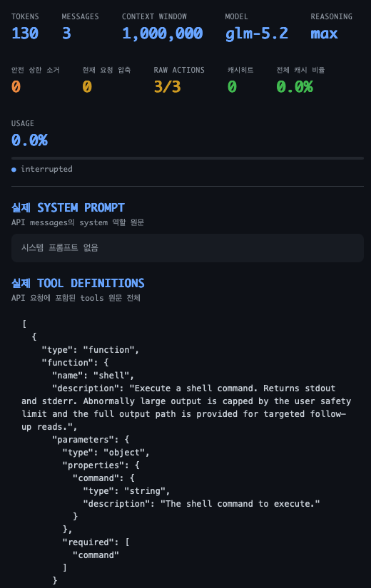
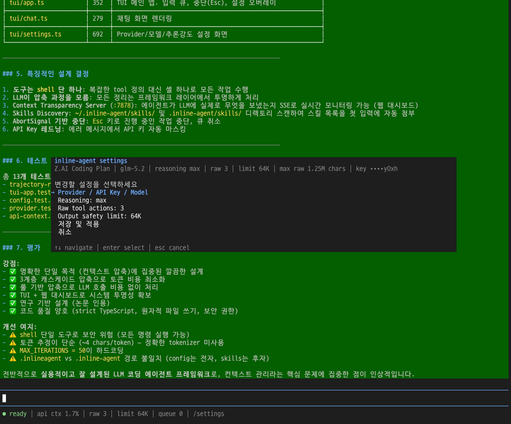

<div align="center">

# inline-agent

**The agent requires nothing but a shell.**

[](LICENSE)
[](https://www.typescriptlang.org/)
[](https://github.com/pinion05/inline-agent/pulls)

</div>

---

## 왜 필요한가

LLM 에이전트는 매 스텝마다 전체 대화 기록을 재전송한다. 한 번 생성된 토큰은 영원히 컨텍스트에 남아 매 API 호출마다 비용을 발생시킨다.

```
Claude 4 Sonnet 일일 사용량: 100B 토큰
├── 입력 (재독): 99B (99%)
└── 생성:         1B  (1%)
```

> *Xiao et al., FSE 2026 · [arxiv.org/abs/2509.23586](https://arxiv.org/abs/2509.23586)*

**비용의 99%는 같은 텍스트를 반복해서 읽는 데 쓰인다.**

### 그 안에는 무엇이 있는가

SWE-bench Verified 평균 트레이토리 — 48.4K 토큰, 40스텝:

| 구성 | 토큰 | 비율 | 실상 |
|------|------|:----:|------|
| tool 결과 (observations) | 30.4K | 63% | 대부분 expired — 다음 스텝에서 무의미 |
| tool_call 인자 (actions) | 11.9K | 25% | 결과에 반영된 후 오버헤드 |
| assistant 추론 | 1.8K | 4% | — |
| system/user | 4.4K | 9% | — |

정크의 세 가지 패턴:

- **Useless** — `ls` 결과의 `__pycache__/`, `.git/`, `.venv/`. 처음부터 불필요.
- **Redundant** — edit 도구가 `old_str`을 action·result·이전 파일에 3중 복사.
- **Expired** — 29개 통과한 테스트. 원인 파악 후엔 무의미.

## 핵심 발견: 정크를 빼면 더 잘한다

| 연구 | 방법 | 절감 | 성능 |
|------|------|:----:|:----:|
| **AgentDiet** · FSE 2026 | 슬라이딩 윈도우 트레이토리 압축 | 40~60% | ±2%p |
| **CoACT** · 2026 | next-action 보존 observation 압축 | 33% | **+3.5%p** |
| **Focus/ACC** · 2026 | 점앀모델 영감 자기 압축 (sawtooth) | 22.7% | 동일 |
| **Simple Masking** · NeurIPS WS 2025 | 규칙 기반 마스킹만 | ~LLM 요약 수준 | 동일 |
| **ACON** · ICLR 2026 | 실패 trajectory 기반 가이드라인 학습 | 26~54% | 유지 |

긴 컨텍스트는 LLM 성능을 **능동적으로 저하**시킨다 ([Liu et al. 2023](https://arxiv.org/abs/2307.03172)). 정크를 빼면 agent가 더 잘한다.

> *"Simple Observation Masking Is as Efficient as LLM Summarization"* — 규칙 기반 압축이 비싼 LLM 요약과 동일 효과. ([Lindenbauer et al., NeurIPS WS 2025](https://arxiv.org/abs/2508.21433))

## LLM은 스스로 컨텍스트를 못 줄인다

AgentDiet가 LLM에게 `erase` 도구를 줬다. "17번 스텝이 불필요하면 지워라."

**Claude 4 Sonnet도 지우지 않았다.** 그냥 원래 태스크를 계속했다.

Focus/ACC 논문도 같은 결론: passive 프롬프트로는 압축이 2회/태스크에 그쳤고, aggressive 프롬프트로 6회까지 끌어올려야 효과가 났다. LLM은 훈련 데이터에 박힌 절차를 따라가느라 자기 컨텍스트를 정리하지 않는다.

**결론: LLM이 모르게 외부에서 정리해야 한다.** 이것이 inline-agent가 존재하는 이유다.

## 작동 방식

```
최근 N턴      과거 턴
────────       ────────
원본 유지  →   "$ command → 결과 요약" 으로 병합
                  │
                  ├─ 통과한 테스트, 디렉토리 리스팅 → 삭제
                  ├─ 에러, 실패, diff, 변경사항     → 원문 보존
                  └─ 나머지                        → 압축
```

LLM 호출 없음. 순수 규칙 기반. "Simple Masking" 논문이 증명한 대로, 이것이 LLM 요약만큼 효과적이다.

### 정보 가치 위계

```
최고가치 │ 에러 · 실패한 테스트 · 파일 변경        → 절대 보존
고가치   │ 결과 핵심 · 다음 스텝과 직결되는 정보     → 보존
중가치   │ 전체 결과 원문 · action/명령어           → 압축 또는 temp file 분리
최저가치 │ 통과한 테스트 · 디렉토리 리스팅 · 빌드로그 → 삭제
```

## 컨텍스트 투명성

에이전트가 API에 보내는 메시지 배열을 SSE로 실시간 브로드캐스트한다. Astro + SolidJS 대시보드에서 토큰 사용량, 압축 이력, 각 메시지를 손실 없이 확인할 수 있다.



```
📊 http://localhost:7878
├── 실시간 토큰 사용량 progress bar
├── 압축 발생 이력 (N → M messages)
├── 각 메시지 카드 (role별 색상, COMPRESSED 배지)
└── API에 들어가는 원본 그대로
```


<br/>
row-action을 full 로 받으며 낮은 캐리생성/캐시리드 비율로 빠르케 새로운정보 사전정보 컨텍스트를 주입받음
<br/>

<br/>
29턴 이후 76k line 의 프로젝트를 모두 분석했지만 더이상 필요가 없는 row-action 을 소거 후 오히려 컨텍스트가 줄어든 모습(캐시리드는 선형적으로 비율이 증가하여 롱태스크에서는 98%이상에서 유지됨.)


## Retained-mode TUI 설정

채팅 화면에서 `/settings`를 입력하면 대화를 유지한 채 Provider/API Key/Model, reasoning, raw tool action 수, 출력 안전 상한을 변경할 수 있다.



## 철학

1. **정크가 LLM을 죽인다** — 토큰이 많을수록 좋은 게 아니다. 정크를 빼면 더 똑똑해진다.
2. **LLM은 정리를 못 한다** — 외부 레이어가 보이지 않게 처리한다.
3. **고가치 토큰만 남긴다** — 에러, 실패, 변경사항은 보존. 나머지는 압축·삭제.
4. **방해하지 않는다** — 시스템 프롬프트 0줄. 도구는 최소. 프레임워크는 조용히 한다.

인간의 단기기억과 같다 — 뇌도 능동적으로 잊어버린다. 모든 걸 기억하려 하면 과부하가 온다. inline-agent는 뇌의 망각 시스템을 코드로 구현한 것이다.

## References

### 트레이토리 / observation 압축
- Xiao et al., *"AgentDiet: Improving the Efficiency of LLM Agent Systems through Trajectory Reduction"*, FSE 2026 — 슬라이딩 윈도우 트레이토리 압축, 40~60% 절감, LLM 자기 정리 불가 증명 · [arxiv.org/abs/2509.23586](https://arxiv.org/abs/2509.23586)
- Chen et al., *"CoACT: Action-Preserving Observation Compression for Coding Agents"*, 2026 — NAP 기반 observation 압축, 33% 절감, pass@1 +3.5%p · [arxiv.org/abs/2607.02911](https://arxiv.org/abs/2607.02911)
- Verma, *"Focus: Active Context Compression"*, 2026 — 점앀모델 영감 sawtooth 압축, 22.7% 절감 · [arxiv.org/abs/2601.07190](https://arxiv.org/abs/2601.07190)
- Lindenbauer et al., *"The Complexity Trap: Simple Observation Masking Is as Efficient as LLM Summarization"*, NeurIPS WS 2025 — 규칙 기반 마스킹 = LLM 요약 효과 · [arxiv.org/abs/2508.21433](https://arxiv.org/abs/2508.21433)
- Sun et al., *"Scaling Long-Horizon LLM Agent via Context-Folding"*, 2025 · [arxiv.org/abs/2510.11967](https://arxiv.org/abs/2510.11967)
- Kang et al., *"ACON: Optimizing Context Compression for Long-horizon LLM Agents"*, ICLR 2026 — 실패 trajectory 기반 가이드라인 학습 · [arxiv.org/abs/2510.00615](https://arxiv.org/abs/2510.00615)
- Ye et al., *"AgentFold: Long-Horizon Web Agents with Proactive Context Management"*, ICLR 2026 · [arxiv.org/abs/2510.24699](https://arxiv.org/abs/2510.24699)

### 메모리 / 계층적 관리
- Zhou et al., *"MEM1: Learning to Synergize Memory and Reasoning"*, NeurIPS 2025 · [arxiv.org/abs/2506.15841](https://arxiv.org/abs/2506.15841)
- Hu et al., *"HiAgent: Hierarchical Working Memory Management"*, ACL 2025 · [aclanthology.org/2025.acl-long.1575](https://aclanthology.org/2025.acl-long.1575/)
- Packer et al., *"MemGPT: Towards LLMs as Operating Systems"*, 2023 — OS 가상 메모리 계층 · [arxiv.org/abs/2310.08560](https://arxiv.org/abs/2310.08560)
- Liu et al., *"CAT: Context as a Tool for Long-Horizon SWE-Agents"*, 2025 · [arxiv.org/abs/2512.22087](https://arxiv.org/abs/2512.22087)

### 인지 / 장기 맥락
- Liu et al., *"Lost in the Middle: How Language Models Use Long Contexts"*, TACL 2023 · [arxiv.org/abs/2307.03172](https://arxiv.org/abs/2307.03172)
- Xiao et al., *"Context Compression for LLM Agents: A Survey"*, 2026 — 60+ 논문 종합 survey · [github.com/YerbaPage/Awesome-Agent-Context-Compression](https://github.com/YerbaPage/Awesome-Agent-Context-Compression)

### 프로덕션 참고
- Pi (earendil-works) — temp file truncation, cut-point compaction, binary sanitization
- OpenCode (sst) — Retry-After 헤더 파싱, overflow 계산, truncation 힌트
- Claude Code (Anthropic) — 5단계 캐스케이드 compaction, prompt cache 보존 설계

<div align="center">

---

LLM은 이미 충분히 똑똑하다. 프레임워크가 할 일은 정크를 치우는 것뿐이다.

</div>
